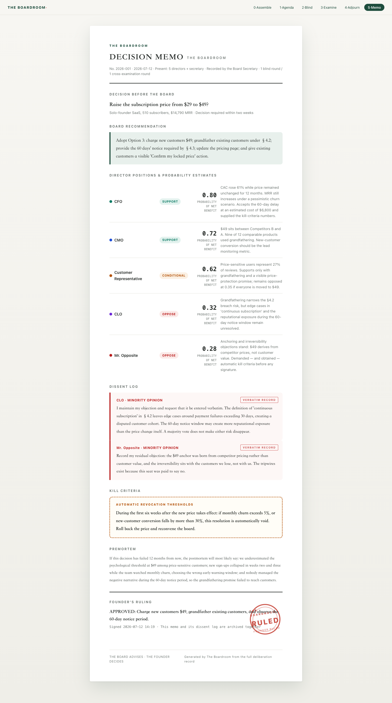

# The Boardroom

> **ChatGPT will agree with you. Your board won't.**



**The Boardroom is an anti-sycophancy decision system for the company of one.** It puts a consequential decision before a data-driven virtual board, moves through **blind review → cross-examination → premortem**, and produces a formal Decision Memo with a **dissent log**, director probability estimates, and **kill criteria**. The board advises. **The founder always decides.**

## Run It — Zero Dependencies

```bash
open site/index.html
```

It is a pure static demo: no network, API, package install, or build step. Use `site/index.html#act5` to open the Decision Memo directly, or `#act2!` to open the completed blind-review state.

## Why This Is Not Another AI Adviser

The usual pattern gives one model one shared context, then assigns several personas through prompts. Every "adviser" sees the founder's preference, anchors on the same information, and naturally converges.

The Boardroom makes disagreement structural:

| Mechanism | Implementation |
|---|---|
| **Blind-review isolation** | Every director is a separate call whose prompt contains only that director's evidence slice. Peer positions and the founder's preference are absent by construction. |
| **Exclusive evidence pipelines** | The CFO receives the financial CSV; the Customer Director receives reviews; the Risk Director receives the terms; the Market Director receives market intelligence. Each evidence stream must be fully developed before fusion. |
| **Mandated dissenter** | The Risk Director is rewarded for finding the strongest objection, not for preserving harmony. |
| **Delayed fusion** | Isolation governs only the first round. The walls then fall, all evidence is revealed, and directors may revise. Information-gap disagreements resolve; **surviving dissent** is preserved verbatim. |
| **Governance output** | The result is a Decision Memo with positions, probabilities, dissent, kill criteria, and a blank founder's ruling—not a chat transcript. |

In one sentence: **diversity comes from evidence pipelines and mandates, not personas.** The same model disagrees because it sees different evidence, demonstrating that the disagreement comes from information.

## Repository

```text
site/index.html          Six-act demo: assemble → agenda → blind review → cross-examination → adjourn → memo
site/cache.js            Precomputed scenario cache, aligned with the orchestrator schema
scripts/generate.py      Judge-readable orchestrator; isolation enforced by construction
scripts/validate_cache.py Cache and deliberation-beat validator
data/                    Fictional financials, reviews, terms, market brief, and decision case
tests/                   One folder per acceptance test, with explicit pass criteria
docs/                    Design and submission materials
```

```bash
python3 scripts/generate.py --dry-run
python3 scripts/validate_cache.py
```

## Alignment with the Hackathon Thesis

The organizer's thesis is *Autonomous Agents & Sovereignty — human judgment guides AI execution.*

Most teams are building execution agents that do work for a one-person company. The Boardroom builds the missing **judgment layer**: AI produces recommendations, dissent, probability estimates, and kill criteria, but the ruling field remains blank until the founder signs it. That is sovereignty expressed as a product interaction.

## What Is Real Today vs. Roadmap

- **Demonstrated today:** isolated blind review, exclusive evidence pipelines, delayed evidence fusion, cross-examination, and a governance document with dissent and kill criteria. The demo uses a precomputed cache; the orchestrator code exposes the real architecture.
- **Roadmap:** domain-specialist evidence and methods → heterogeneous-model support → a director marketplace where specialist seats can be subscribed to individually.
- We do not claim that multi-agent debate is always more accurate. We claim a stronger decision procedure: less anchoring, less sycophancy, deeper evidence extraction, and disagreements converted into explicit governance signals.

## Team

A company of one, protected by a board. 🪑
